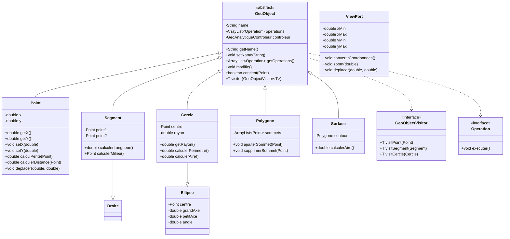

# Rapport du Projet GéoAnalytique

## Introduction
Ce rapport présente le développement de l'application GéoAnalytique, un logiciel de dessin et manipulation de formes géométriques en Java. Le projet a été réalisé dans le cadre du cours de programmation du Département Génie Informatique (DIC2) de l'École Supérieure Polytechnique (ESP) de l'UCAD.

## 1. Architecture du Projet

### 1.1 Structure MVC+Présenteur
L'application suit une architecture MVC enrichie d'un Présenteur, permettant une séparation claire des responsabilités :

- **Modèle** : Gestion des objets géométriques (package `geoanalytique.model`)
- **Vue** : Interface utilisateur et affichage (package `geoanalytique.view`)
- **Contrôleur** : Gestion des interactions (package `geoanalytique.controleur`)
- **Présenteur** : Conversion des coordonnées (classe `ViewPort`)

### 1.2 Diagramme de Classes
Le diagramme de classes suivant illustre la structure de notre application :

## 2. Implémentation du Modèle

### 2.1 Classes Géométriques (Questions 1-3)

#### Classe de Base : GeoObject
La classe abstraite `GeoObject` définit les caractéristiques communes à tous les objets géométriques :
- Gestion des noms
- Liste des opérations disponibles
- Mécanisme de notification des modifications
- Pattern Visiteur pour le traitement des objets

#### Point
- Attributs :
  - `x` : double (abscisse)
  - `y` : double (ordonnée)
- Opérations :
  - Calcul de distance
  - Calcul de pente
  - Déplacement
  - Calcul du milieu

#### Segment
- Attributs :
  - `point1` : Point (première extrémité)
  - `point2` : Point (deuxième extrémité)
- Opérations :
  - Calcul de longueur
  - Calcul du milieu
  - Calcul de la médiatrice

#### Cercle
- Attributs :
  - `centre` : Point
  - `rayon` : double
- Opérations :
  - Calcul du périmètre
  - Calcul de l'aire
  - Intersection avec une droite

#### Autres Formes
- Ellipse
- Polygone
- Surface

### 2.2 Opérations Géométriques (Questions 4-5)

#### Opérations de Base
- Déplacement de points
- Calcul de distances
- Calcul de milieux
- Calcul de pentes

#### Opérations Avancées
- Médiatrices
- Cercles circonscrits
- Intersections
- Calculs de surfaces et périmètres

## 3. Interface Utilisateur (Question 6)

### 3.1 Conception de l'Interface
L'interface utilisateur comprend :
- Une zone de dessin centrale avec repère orthogonal
- Une barre d'outils pour les opérations
- Un menu pour les fonctionnalités avancées
- Gestion des sélections et déplacements

### 3.2 Composants Graphiques (Question 7)
Les classes du package `geoanalytique.graphique` assurent le rendu des formes :
- Conversion des coordonnées réelles en coordonnées écran
- Gestion des couleurs et styles
- Affichage des axes et grille

## 4. Contrôleur et Présenteur (Questions 8-11)

### 4.1 Conversion Modèle-Vue
Le `Dessinateur` convertit les objets géométriques en représentations graphiques :
- Utilisation du pattern Visiteur
- Gestion des transformations de coordonnées
- Optimisation des performances

### 4.2 Gestion des Coordonnées
La classe `ViewPort` gère :
- Conversion des coordonnées réelles en coordonnées écran
- Gestion du zoom et du déplacement
- Maintien de la cohérence des transformations

### 4.3 Gestion des Interactions
Les méthodes principales :
- `addObjet` : Ajout d'objets géométriques
- `selectionner` : Sélection d'objets
- `deselectionner` : Désélection d'objets
- Gestion des événements souris

## 5. Fonctionnalités Avancées (Questions 12-13)

### 5.1 Extensions
- Zoom et déplacement de la vue
- Sauvegarde et chargement d'images
- Drag-and-drop des objets
- Opérations multiples (ex: intersections cercle-droite)
- Calculs de surfaces et périmètres

## 6. Conclusion

### 6.1 Bilan du Projet
Le projet GéoAnalytique a permis de mettre en pratique :
- Les concepts de programmation orientée objet
- Le pattern MVC enrichi
- La gestion des transformations géométriques
- L'interface utilisateur graphique

### 6.2 Perspectives d'Amélioration
- Ajout de nouvelles formes géométriques
- Amélioration des performances
- Extension des fonctionnalités d'exportation
- Ajout de nouvelles opérations géométriques

## 7. Annexes

### 7.1 Documentation Technique
La documentation technique complète est disponible dans le dossier `doc/`.

### 7.2 Guide d'Utilisation
Un guide d'utilisation détaillé est fourni avec l'application.

---

*Note : Les images seront remplacées par les captures d'écran appropriées lors de la finalisation du projet.* 